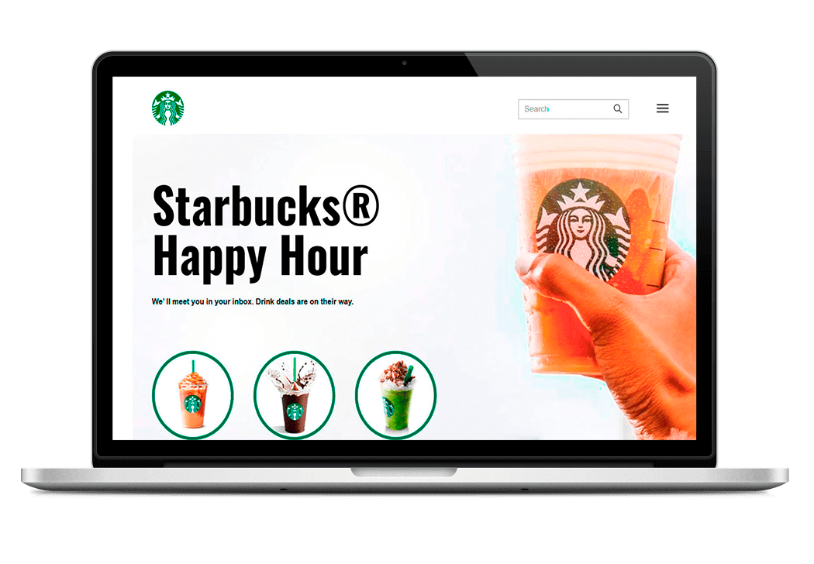

<h1 align="center" id="topo">Projeto StarBuks</h1>

<div align="center">

</div>


### 💻 Projeto

Landing Page StarBucks

---

### 🔧 Ferramentas

O projeto foi desenvolvido com as seguintes ferramentas:

#### 🧪 Tecnologias

- HTML
- CSS


---

### 🚀 ​ [Clique aqui](https://projeto-star-bucks.vercel.app/)🔗 e veja o projeto no ar.

---

### ​👷‍♂️​ Acessar o Projeto

<a href="https://github.com/devfullmaster/Projeto-StarBucks/tree/main">Acesse aqui</a>🔗 o código fonte pelo GitHub.

Faça o <a href="https://github.com/devfullmaster/Projeto-StarBucks/archive/refs/heads/main.zip">Download aqui</a>🔗 do código fonte no formato zip.

Clone o repositório:

```
git clone https://github.com/devfullmaster/StarBuck.git
```

---

### 📝 License

Esse projeto é licenciado pela MIT License. Clique [aqui](https://pt.wikipedia.org/wiki/Licen%C3%A7a_MIT)🔗 para mais detalhes.


#### 💬 Sinta-se a vontade para entrar em contato

[](https://www.linkedin.com/in/devfullmaster/ ) [](https://github.com/devfullmaster) [](mailto:contato@devfullmaster.dev)

---

> Desenvolvido com ❤️ por **Rudy Almeida Silva**

---